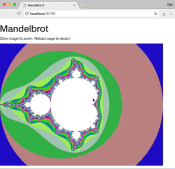

# Mandelbrot-go
Simple Mandelbrot set webservice written in go (golang).

Install [golang](https://golang.org/doc/install), pull the code and:

```bash
go run main.go
```

Browse to [localhost:8090](http://localhost:8090/) and view the results:



## Testing 

```bash
go test
```

## Background
This was written by me as an exercise in learning go.  The code is as simple as possibly demonstrating a simple
webserver with a very simple template and a [Mandelbrot](https://en.wikipedia.org/wiki/Mandelbrot_set) webservice that 
creates images on the fly.  Just over 100 lines of golang code.

There are many more better tools to view the mandelbrot set but this is a fun way to play with go.

# Build status


# License
MIT (very permissive)
